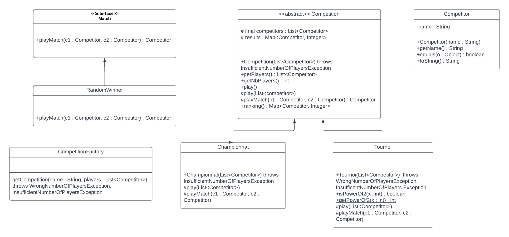
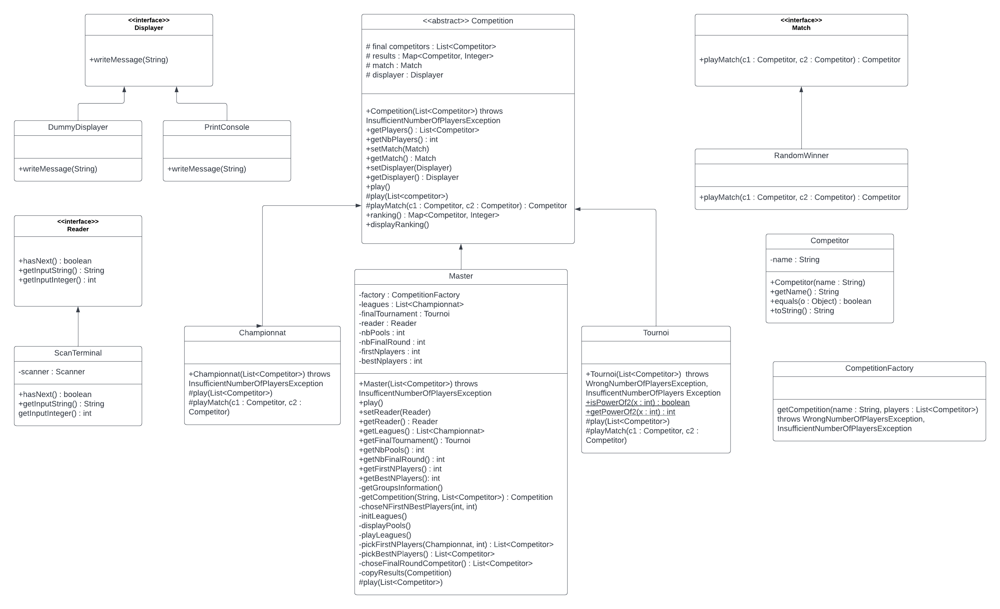

## Projet - Compétitions Sportives
---

## Done by

**Bilal EL Safah**


---

## Files

```text
l3s5-projet-coo/
├── src/
│   └── competition/
│       ├── event/
│       │   ├── Championnat.java
│       │   ├── Competition.java
│       │   ├── Tournoi.java
│       │   └── CompetitionFactory.java
│       ├── exception/
│       │   ├── InsufficientNumberOfPlayersException.java
│       │   ├── IntegerNotPowerOf2Exception.java
│       │   └── WrongNumberOfPlayersException.java
│       ├── match/
│       │   ├── Match.java
│       │   └── RandomWinner.java
│       │
│       ├── Competitor.java
│       └── Main.java
│   └── util/
│       └── MapUtil.java
├── test/
│   └── competition/
│       ├── event/
│       │  ├── ChampionnatTest.java
│       │  ├── CompetitionTest.java
│       │  ├── TournoiTest.java
│       |  └── CompetitionFactoryTest.java
│       ├── match/
│       │  └──RandomWinnerTest.java
│       │
│       └── CompetitorTest.java
│
│
├── exec.jar
│   MakeFile
├── manifest.
├── test4poo.jar
└── readme.md
```

## Objectives
###  Representing a competition

We are interested in the constructing a model to represent different types of competition. Each competition have its own rules, in terms of the minimum number of players that can participate, a constrain on the number of players in general (such as the obligation of it being a power of 2), and many other.

modeling different types of matchs. For this version, we are only interested in having match in which the outcome is completely random with respect to the competing players.

## Conception

### Version 1



   1. * As shown in the UML diagram, we model the competition concept using an abstract class competition. This common mother class implements the common attributs and methods that will be later used in each competition type.  </br>
      * Common attributs such as list of players, a map assigning each player a score to be retrieved at the end of the competition.  </br>
      * Common methods such as getPlayers, play: its job is to execute the matchs and assign the final scores. </br>
      ranking : get the rankings of the players.
      * Throws an exception in case the given list of players contains less than two players

   2. * Two inheriting classes Tournoi and Championnat which desginates respectively a tounamenent and a league.  </br>
      * The main difference between these two classes is that each one of them organise match between participants in a different way.
      * The players in a League plays againt all other players two times, which is taken care of in the protected method play(players : List<Competitor>).
      * the players in a Tournament plays in a classical format of elimination, which is taken care of in the protected method play(players : List<Competitor>).
      * Tournament class throws an exception in the construction if the number of given players is not a power of two, thus not compatible with a classical format.

   3. * A factory design pattern have been implemented to take care of the choice and construction of the competitions instances.  </br>
   factory's method getCompetition receives a string as first parameter, and depending on the value of that string returns the corresponding competition type.

   4. * Competitors are modeled using the class Competitor.
      * For this version, the role of competitors is limited, thus the class contains simply one attribut name, and methods getName(), toString() and equals().

   5. * Matchs are modeled using the interface Match, all match must have a method playMatch receiving two competitors and returning either one of them as a winner.
      * RandomWinner is a class implementing the interface Match. its playMatch chooses the winner randomly and independently of the competitors.

### Version 2



Whats new ?
   1. * Adding a new class extending competition abstraction, Its the new Master competition.
      * The master is a composition between leagues and tournament, having the original competitors grouped into pools each pool will forgo a league to determine the best players inside each pool, the winners will face each other in a tournament to determine the final winner of the master.
      * The master class requires for its execution a number of information indispensable for its execution, such as the number of pools and the number of players going to the final round. These information are asked from the user through an input interface explained in more details below.
   2. * Adding a new displayer and reader interface, implementing a way to interact with the external environment, displaying useful information and getting user input information. Thus achieving independance between the competitions and the IO objects.
      * PrintConsole, as the name suggests, is a class implementing the displayer interface, printing the message to the standard output.
      * ScanTerminal, as the name suggests, is a class implementing the reader interface, scanning the standard input for any user input necessary for the execution of the program.
      * This implementation offers several advantages, mainly the application of:
         * <span style="color:blue">**Open Closed Principle**</span> : 
            having interfaces for input and output allows adding any extensions to the project in order to further upgrade the performance by displaying to a monitor without having a negative impact on the already functionning methods.
         * <span style="color:blue">**Single Responsability Principle**</span> :
            The competitions responsability is unified, managing the competition only, and being separated from the task of managing the interaction with the external environment. Instead this responsability is being taken care of using the new interfaces.
         * <span style="color:blue">**Dependency Inversion Principle**</span> :
            Now the competitions are independent of class objects managing the interaction with the external environment (not dependent on the use of System.out.println or scanner object). Instead it is made dependent of general use interfaces allowing any class inheriting these interfaces to manage the task of interacting with the external environment.
   3. * Mock testing has been added to further test the correct functionning of play method in competitions, the mock match force the return value of the winner between two competitor instead of making it random, thus predicting the progress of the competition.
      * MockDisplayerReader imitates the case of a user's input.
      In some cases such as the master class initialisation phase, the input of user information is indispensable. Thus making creating a difficulty in the testing phase which will be confronted with the task of providing these information to object. Hence the use of the mock is relevant, it is capable of providing some predetermined value to the object the predict the progress of the program further improving the test quality.
   4. * Adding a new exception extending runtime exception.
      * While the core implementation of the master class is a composition of leagues and tournament, these two classes throws exception on the initialisation phase, meant to alert the client on the usability of these two objects. Since now they are being used by another object and not a client, their corresponding prerequisites will be dealt with by this object and thus any exception that may occur is out of reach of the client, and he can not recover from it, thus the creation of a new runtime exception decision is found important.

## How TO

### Getting the files
1. To compile and execute the files, you need to install [JDK Java SE](https://www.oracle.com/java/technologies/javase-downloads.html).

2. Get the project with the following command
```bash
git pull
```


### Generate JavaDoc files
* In a bash terminal

1. To generate the Javadoc for the competition package and all its sub packages:

In the root directory of the project, execute the following command:
```bash
   javadoc competition -sourcepath src -d docs -subpackages competition
```
or by executing:

```bash 
   make docs
```

You will notice a new directory docs.

2.  To consult the JavaDoc: in the docs Directory, open the index.html file in a web browser.


### Compile .java files
* In a bash terminal

1. Go to the root folder (the folder containing src and test directory)

2. Compile all the .java file, and store them in the classes folder, using the makefile.
```bash
   make src
```

3. You will notice that the classes folder contains the structure of the packages containing the compiled files with a .class extension.


-------------------------------------------------------------------------------------------------------

### Compile and execute the tests
* In a bash terminal

1. Go to the root folder (the folder containing src and test directory)

2. To compile all the test files, excute the following command :
```bash
   make test
```

3. To Execute a test package.subPackage.FileNameTest, execute the following command
```bash
   java -jar junit-platform-console-standalone-1.9.1.jar --class-path classes --select-class package.subPackage.FileNameTest
```
for example executing the test corresponding to Tournoi :
```bash
   java -jar junit-platform-console-standalone-1.9.1.jar --class-path classes --select-class competition.event.TournoiTest
```

4. A graphic interface will pop up. A green line means that all the tests have been passed correctly, a red line means that there are some tests that failed.

5. To Execute all the tests at once, execute the following command
```bash 
   java -jar junit-platform-console-standalone-1.9.1.jar --class-path classes --select-package competition
```


### Generate the executable .jar files
1. Go to the root directory of the project, and execute the following command :
```bash
   jar cvfe exec.jar competition.Main -C classes competition -C classes util
```
* or by executing

```bash
   make exec.jar
```

2. You will notice that an exec.jar file has been created.


### Execute the program
* Without using the exec.jar file

   1. Go to the root directory

   2. To execute the main class, there are diffrent arguments you can add:

         1. precising the competition type as first parameter and then the player's names:

   ```bash
           java -classpath classes competition.Main type player1 player2
   ```
   * Example:
   ```bash
           java -classpath classes competition.Main Tournament player1 player2
   ```

   3. You will notice that the Main has been executed, the match are being played, and finally the results will be shown.

* Using the exec.jar file

    1. Go to the root directory

    2. To execute the jar file, you can add the same arguments as above:

        1. precising the competition type as first parameter and then the player's names:

           ```bash
           java -jar exec.jar type player1 player2
           ```
            * Example:
           ```bash
           java -jar exec.jar Tournament player1 player2
           ```

    3. You will notice that the Main has been executed, the match are being played, and finally the results will be shown.
